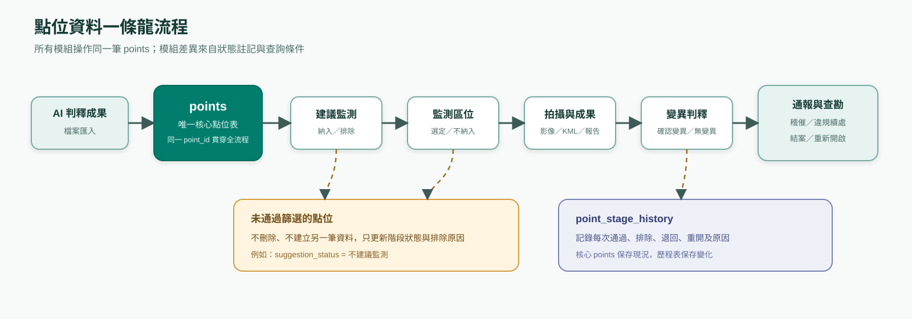
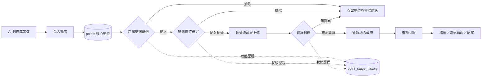
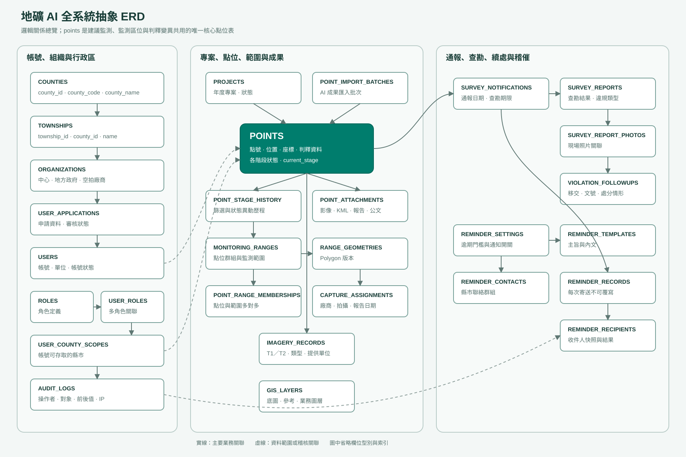
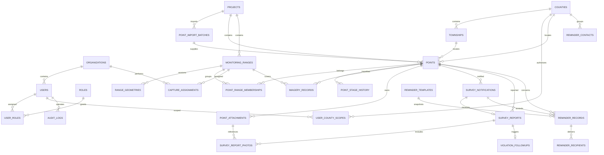
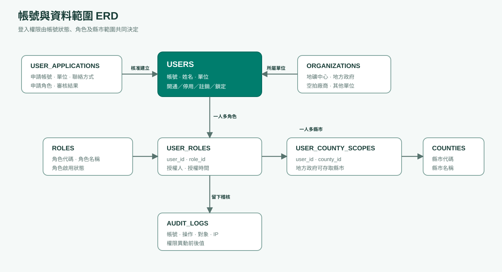
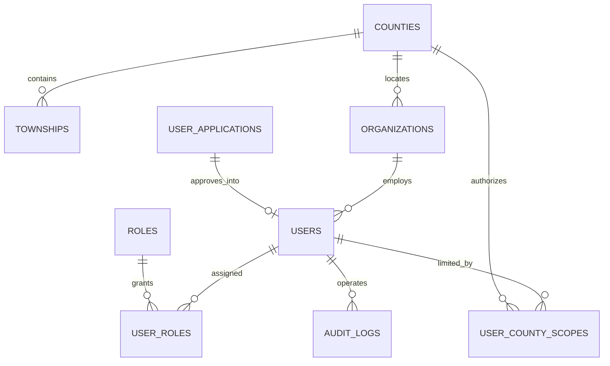
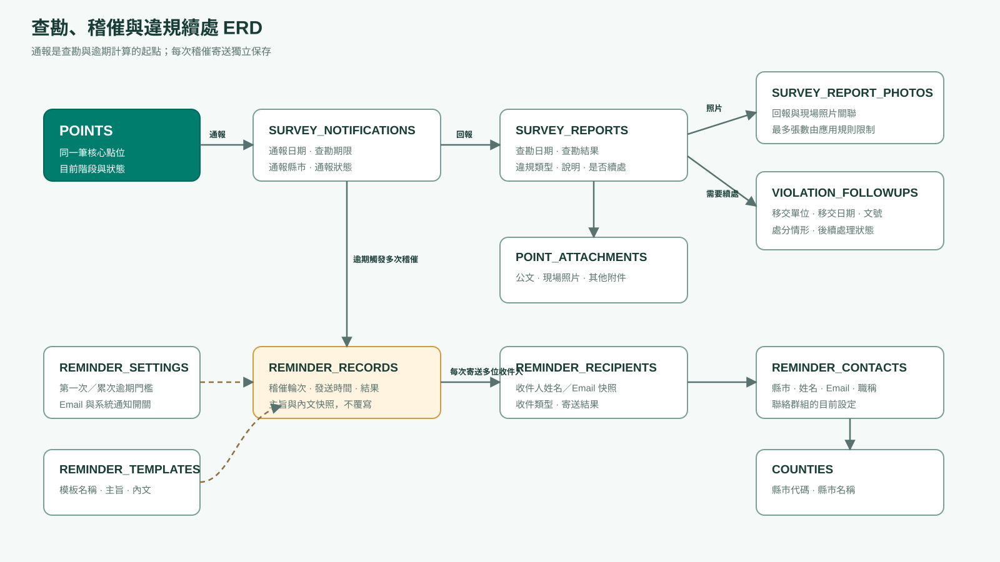
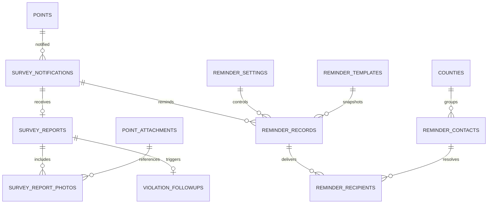

# 地礦 AI 抽象 ERD

版本：草案 v1
設計層級：邏輯資料模型
對應文件：[介面欄位完整盤點](地礦AI_介面欄位完整盤點.md)、[資料表設計規格](地礦AI_資料表設計規格.md)

## 1. 點位一條龍流程

圖檔：[SVG](assets/diagrams/point-lifecycle-overview.svg)｜[PNG](assets/diagrams/point-lifecycle-overview.png)

重點：所有階段都操作同一筆 `points`。點位未通過某階段時只更新狀態與原因，不另建點位、不刪除。

## 2. 全系統 ERD 總覽

圖檔：[SVG](assets/diagrams/abstract-erd-overview.svg)｜[PNG](assets/diagrams/abstract-erd-overview.png)

## 3. 帳號權限 ERD

圖檔：[SVG](assets/diagrams/access-control-erd.svg)｜[PNG](assets/diagrams/access-control-erd.png)

權限判斷必須同時考慮：

1. 使用者帳號狀態。
2. 使用者擁有的角色。
3. 角色可使用的模組與操作。
4. 地方政府的縣市資料範圍。
5. 空拍廠商的指派專案／範圍。

## 4. 查勘、稽催與違規續處 ERD

圖檔：[SVG](assets/diagrams/survey-reminder-erd.svg)｜[PNG](assets/diagrams/survey-reminder-erd.png)

## 5. 關聯摘要

| 主體 | 關聯 |
|---|---|
| 專案與點位 | 一個專案包含多筆點位 |
| 匯入批次與點位 | 一個批次匯入多筆點位；同點號不得重複建立 |
| 點位與範圍 | 多對多，透過 `point_range_memberships` |
| 點位與階段歷程 | 一對多，每次篩選或狀態變更都新增歷程 |
| 範圍與拍攝指派 | 一對多，允許重新指派或保留歷次指派 |
| 點位與附件 | 一對多 |
| 點位與通報 | 一對多，是否允許重複通報待確認 |
| 通報與查勘回報 | 原則上一筆有效通報對一筆有效回報 |
| 查勘回報與違規續處 | 無違規時沒有續處；需要續處時建立一筆 |
| 通報與稽催 | 一對多，每次寄送不可覆寫 |
| 稽催與收件人 | 一對多，保存寄送當下收件資料快照 |
| 使用者與角色 | 多對多 |
| 使用者與縣市範圍 | 多對多 |

## 6. 尚未定案但不影響總體關係

- AI 成果檔案格式及匯入觸發方式。
- 正式縣市代號表。
- 範圍代號規則。
- PostGIS 是否於第一階段啟用。
- 同一自然地點跨年度出現時的識別規則。
- 違規後續處理資料的正式維護角色。
