# 地礦 AI 功能模組、業務流程與開發分工說明

> 文件狀態：第一階段開發參考稿
>
> 更新日期：2026-08-25
>
> 適用對象：系統分析、前端、後端、GIS、AI 與測試人員

## 1. 文件目的

本文件提供工程團隊快速理解本系統的角色權限、功能模組、操作流程、資料流向及開發分工。內容以業務邏輯與畫面行為為主，不展開 API、資料表及 AI 模型技術規格。

文件判讀優先順序如下：

1. 本文件所列「正式版 RBAC 與權責分離決策」。
2. `115 地礦AI_系統工項規畫.xlsx` 的工作項目與承辦人分配。
3. `archive/original/地礦AI_雛型_v16_0825_feedback.html` 的既有畫面與互動。

若雛形與正式版決策不一致，工程實作一律以本文件的「正式版」規則為準。畫面截圖只用來協助辨識介面，不代表截圖中的全部權限都可直接沿用。

> 本文件截圖均以 v16、1920 × 863 的同一 Chrome 視窗重新擷取。v16 仍有部分角色頁面空白或權限展示與正式 RBAC 不一致，已在對應章節標示；這些是雛型缺口，不代表正式功能可省略。

## 2. 系統角色與資料範圍

| 角色 | 主要責任 | 可存取的資料範圍 | 權責限制 |
|---|---|---|---|
| 地礦中心承辦 | 管理全國監測案件、確認區位、通報地方政府、稽催、結案及管理帳號 | 全國／全縣市業務資料 | 可管理使用者；不可查看系統日誌 |
| 空拍廠商 | 提供建議點位、執行受派空拍、上傳判釋報告與 KML | 被指派的專案、年度及拍攝區域 | 不可查看其他廠商或未指派案件 |
| 地方政府人員 | 接收通報、填寫查勘結果、提供逾期原因與違規後續資料 | 帳號被授權的縣市 | 不可查看其他縣市資料 |
| 系統管理員 | 帳號、角色、縣市授權與系統操作日誌管理 | 使用者及系統稽核資料 | **不得看見或操作任何業務功能** |

### 2.1 資料授權實作原則

- 前端選單隱藏與後端授權檢核必須使用同一套權限規則。
- 後端每次查詢、匯出、下載及異動都必須重新檢查角色與資料範圍，不可只依賴前端傳入的縣市或專案條件。
- 地礦中心承辦的業務查詢預設可涵蓋全國，不應被單一縣市帳號條件限縮。
- 空拍廠商以指派關係過濾；地方政府以帳號縣市授權過濾。
- 系統管理員登入後只能進入使用者管理及系統日誌，首頁也應為管理型首頁，不得載入業務統計。
- 系統管理員不得進入任何業務模組；前端路由、後端端點及批次匯出都必須拒絕業務操作。

## 3. 正式版 RBAC

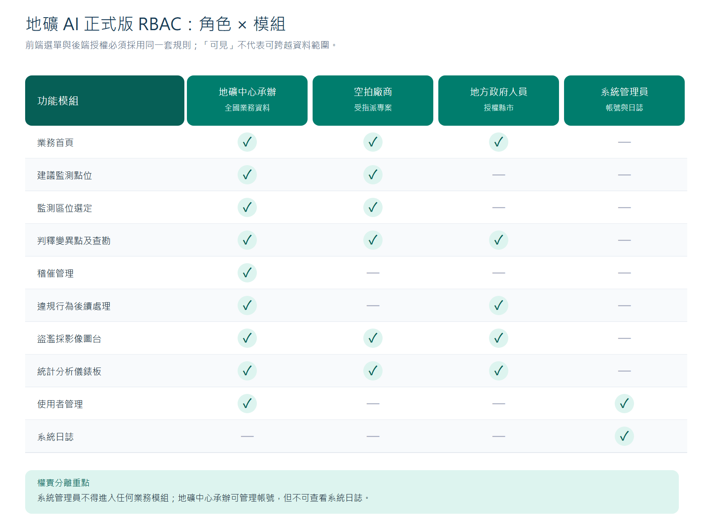

| 功能模組 | 地礦中心承辦 | 空拍廠商 | 地方政府人員 | 系統管理員 |
|---|:---:|:---:|:---:|:---:|
| 業務首頁 | ✓ 全國 | ✓ 指派專案 | ✓ 授權縣市 | — |
| 建議監測點位 | ✓ 全國檢視／納入 | ✓ 指派專案新增／繪製 | — | — |
| 監測區位選定 | ✓ 選定／通知 | ✓ 指派專案檢視與作業 | — | — |
| 判釋變異點結果及查勘回報 | ✓ 全國管理 | ✓ 上傳指派成果 | ✓ 授權縣市回報 | — |
| 稽催管理 | ✓ | — | — | — |
| 違規行為後續處理 | ✓ 全國 | — | ✓ 授權縣市 | — |
| 盜濫採影像圖台 | ✓ 全國 | ✓ 指派專案 | ✓ 授權縣市 | — |
| 統計分析儀錶板 | ✓ 全國 | ✓ 指派專案 | ✓ 授權縣市 | — |
| 使用者管理 | ✓ | — | — | ✓ |
| 系統日誌 | — | — | — | ✓ |

> 權責分離：系統管理員雖可管理帳號及查看系統日誌，但不可代理承辦執行選點、通報、稽催、查勘、結案或任何業務操作。

## 4. 核心業務流程與資料流向

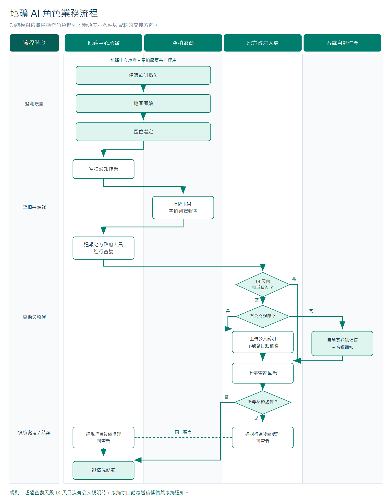

| 階段 | 操作角色 | 功能／操作 | 條件與下一步 |
|---|---|---|---|
| 1 | 地礦中心承辦、空拍廠商 | 建議監測點位 | 共同檢視及處理權限範圍內的建議點位 |
| 2 | 地礦中心承辦、空拍廠商 | 地圖圈繪 | 將建議點位轉為監測範圍 |
| 3 | 地礦中心承辦、空拍廠商 | 區位選定 | 確認後進入空拍通知作業 |
| 4 | 地礦中心承辦 | 空拍通知作業 | 通知空拍廠商執行空拍 |
| 5 | 空拍廠商 | 上傳 KML、空拍判釋報告 | 成果回到地礦中心承辦 |
| 6 | 地礦中心承辦 | 通報地方政府進行查勘 | 形成地方政府的待查勘案件 |
| 7 | 地方政府人員 | 上傳查勘回報 | 回報查勘結果及附件 |
| 8 | 地方政府人員 | 上傳未如期查勘的公文說明 | 有公文時不觸發自動稽催，案件仍待查勘回報 |
| 9 | 系統自動作業 | 寄送稽催信及系統通知 | **超過查勘天數 14 天且沒有公文說明時才觸發**；通知地方政府人員 |
| 10 | 地礦中心承辦、地方政府人員 | 查看違規行為後續處理 | 查勘回報判定需要後續處理時，案件進入同一張後續處理表格 |
| 11 | 地礦中心承辦 | 視情況結案 | 可依查勘回報或後續處理結果辦理結案 |

### 4.1 角色交接規則

- 建議監測點位、地圖圈繪及區位選定由地礦中心承辦與空拍廠商共同使用，但各自仍受 RBAC 資料範圍限制。
- 地礦中心承辦通知空拍廠商；空拍廠商完成後上傳 KML 與空拍判釋報告。
- 地礦中心承辦收到成果後，通報地方政府人員進行查勘；地方政府人員負責上傳查勘回報。
- 地方政府未如期查勘時應上傳公文說明。超過查勘天數 14 天且沒有公文說明時才觸發；條件成立時，系統自動寄送稽催信及系統通知給地方政府人員。
- 查勘回報若需要後續處理，案件進入「違規行為後續處理」表格，地礦中心承辦與地方政府人員皆可查看。
- 地礦中心承辦可依案件情況辦理結案。

## 5. 功能模組與畫面操作

### 5.1 登入／註冊

**負責工程師：守陽**

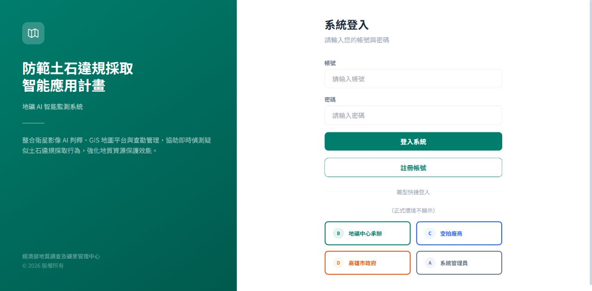

業務規則：

- 使用者以帳號密碼登入；登入成功後依正式版 RBAC 建立選單與首頁。
- 註冊申請送出後進入「使用者管理／待審核」清單，未開通前不得登入。
- v16 的 B／C／D／A 角色快捷登入僅供雛形展示，正式版不得提供。

| 按鈕／控制項 | 可操作角色 | 行為 |
|---|---|---|
| 登入系統 | 未登入使用者 | 驗證帳密；成功後載入角色、縣市／專案範圍及可見選單 |
| 註冊帳號 | 未登入使用者 | 進入帳號申請表 |
| 返回登入 | 註冊申請人 | 放棄目前申請內容並回登入頁 |
| 取消 | 註冊申請人 | 關閉／清除註冊表單，回登入頁 |
| 送出申請 | 註冊申請人 | 建立待審核帳號，不直接開通 |
| B／C／D／A 快捷角色 | 僅雛型展示 | **正式版移除** |
| 登出 | 全部已登入角色 | 清除登入狀態並回登入頁 |

### 5.2 業務首頁

**負責工程師：守陽**

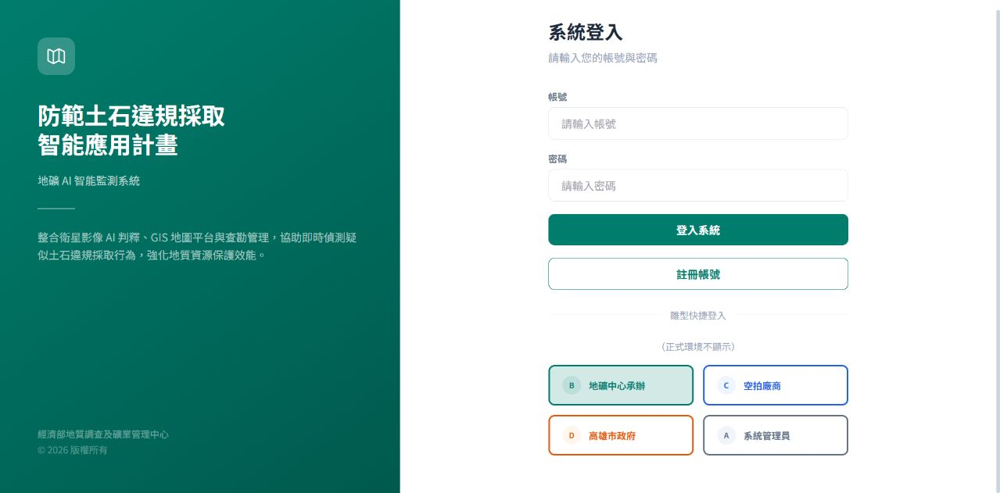

業務規則：首頁顯示監測、回報、逾期及違規摘要，數值與列表都必須套用角色資料範圍。系統管理員不使用業務首頁。

| 按鈕／控制項 | 地礦中心承辦 | 空拍廠商 | 地方政府人員 | 系統管理員 | 行為 |
|---|:---:|:---:|:---:|:---:|---|
| 通知鈴鐺 | ✓ 全國業務通知 | ✓ 指派通知 | ✓ 授權縣市通知 | — | 開啟與本人業務範圍相關的通知 |
| 首頁摘要卡／列表列 | ✓ | ✓ | ✓ | — | 進入相對應案件或模組；不可超出資料範圍 |
| 上一頁／頁碼 1、2、3／下一頁 | ✓ | ✓ | ✓ | — | 切換首頁清單頁次 |

### 5.3 建議監測點位

**負責工程師：育萱；AI 成果提供：忠晏**

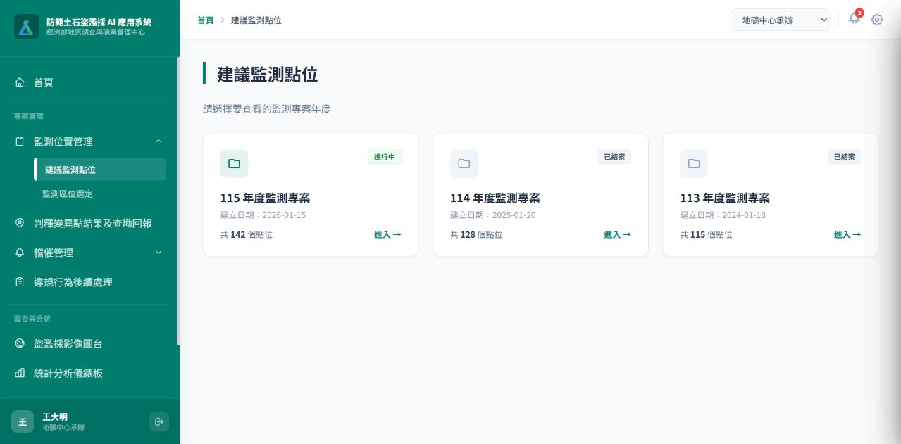

v16 進入年度專案後直接顯示點位列表：

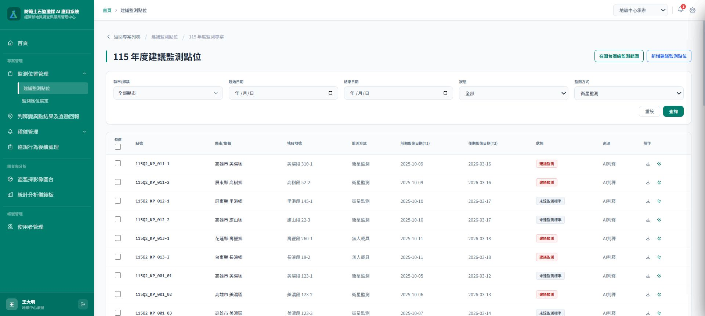

業務邏輯：v16 採「年度專案 → 點位列表」兩層導覽，不再顯示獨立的判釋範圍中介頁。AI 點位及廠商手動點位使用同一批點位資料，依專案／年度及狀態註記篩選；勾選後可加入建議監測並帶入圖台圈繪。地方政府與系統管理員不顯示本模組。

| 按鈕／控制項 | 地礦中心承辦 | 空拍廠商 | 行為 |
|---|:---:|:---:|---|
| 返回專案列表 | ✓ | ✓ | 回上一層專案清單 |
| 重設 | ✓ | ✓ | 清除查詢條件 |
| 查詢 | ✓ 全國 | ✓ 指派專案 | 依條件與角色範圍查詢 |
| 加入建議監測 | ✓ | ✓ 僅指派專案 | 將選取點位納入後續監測清單 |
| 取消建議監測 | ✓ | ✓ 僅本人／指派範圍 | 取消納入；已進入後續流程者應禁止或提示影響 |
| 下載 | ✓ | ✓ 指派範圍 | 下載點位成果 |
| 到圖台／在圖台圈繪監測範圍 | ✓ | ✓ | 將選取點位帶入影像圖台 |
| 新增建議監測點位 | 檢視，不作為主要新增者 | ✓ | 開啟手動新增點位視窗；正式需求由空拍廠商新增／繪製 |
| 建立 | — | ✓ | 儲存手動新增點位 |
| 取消／關閉 × | — | ✓ | 關閉新增視窗且不儲存 |
| 上一頁／頁碼／下一頁 | ✓ | ✓ | 切換清單頁次 |

### 5.4 監測區位選定

**負責工程師：育萱；圖台圈繪介接：金億**

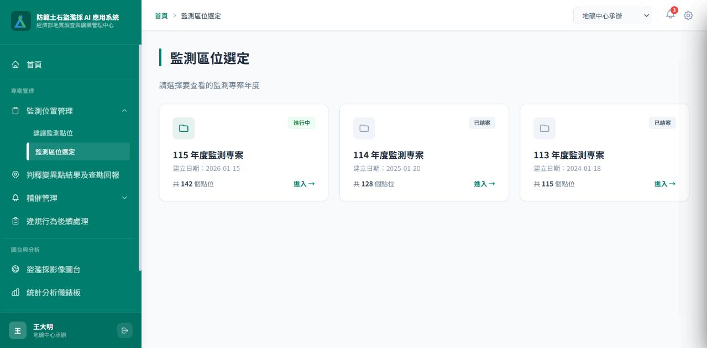

進入年度專案後的建議監測範圍列表：

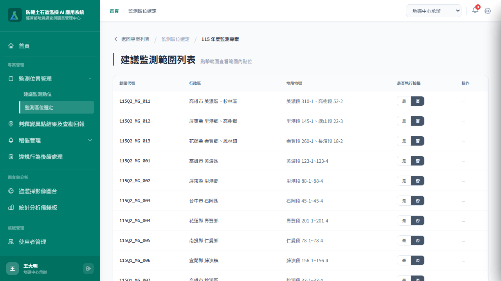

選定範圍後的監測點位列表：

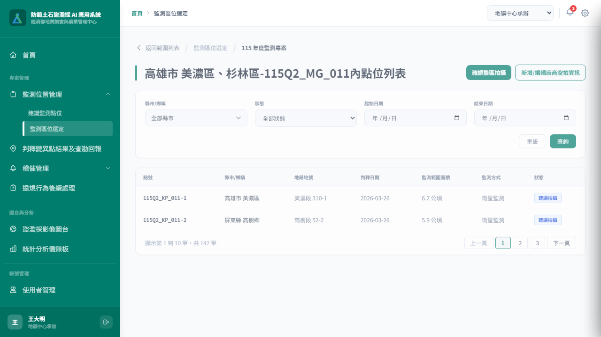

業務邏輯：地礦中心承辦檢視圖台圈繪成果、確認整區拍攝，必要時新增欲空拍點位，並填寫空拍廠商通知資訊。空拍廠商只能處理被指派的專案／範圍。

| 按鈕／控制項 | 地礦中心承辦 | 空拍廠商 | 行為 |
|---|:---:|:---:|---|
| 返回專案／範圍列表 | ✓ | ✓ | 回上一層清單 |
| 重設／查詢 | ✓ 全國 | ✓ 指派範圍 | 重設或執行角色範圍內查詢 |
| 確認整區拍攝 | ✓ | — | 將整個監測範圍確認為拍攝區位 |
| 新增建議拍攝點位 | ✓ | — | 新增地礦中心希望空拍的點位；此為正式版規則 |
| 新增／編輯廠商空拍資訊 | ✓ | — | 維護廠商、通知及拍攝資訊 |
| 儲存 | ✓ | — | 儲存空拍資訊並保留異動紀錄 |
| 手動新增監測範圍 | — | ✓ 指派專案 | 廠商補繪被指派專案的監測範圍 |
| 建立 | — | ✓ | 儲存手動監測範圍 |
| 取消／關閉 × | ✓ | ✓ | 關閉目前視窗且不儲存 |
| 上一頁／頁碼／下一頁 | ✓ | ✓ | 切換清單頁次 |

> v16 雛型仍將「新增建議拍攝點位」顯示給空拍廠商；正式版依工作項目規畫改由地礦中心承辦操作。

### 5.5 盜濫採影像圖台

**負責工程師：金億**

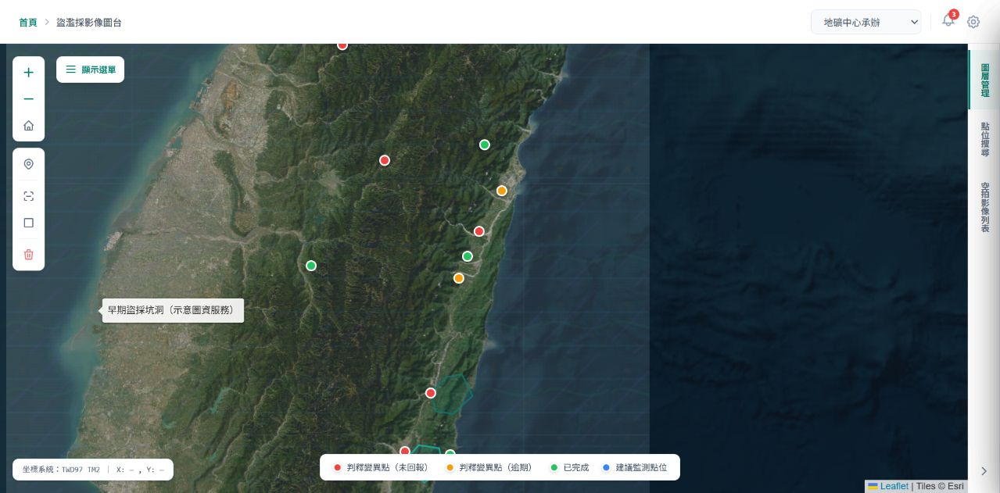

業務邏輯：圖台接收建議點位或監測範圍，提供底圖、圖層、定位、量測、圈繪、影像套疊及查勘紀錄檢視。所有圖層與點位查詢仍須套用角色資料範圍。

| 按鈕／控制項 | 地礦中心承辦 | 空拍廠商 | 地方政府人員 | 行為 |
|---|:---:|:---:|:---:|---|
| 放大／縮小／回到初始視域 | ✓ | ✓ | ✓ | 調整地圖視域；初始視域依角色資料範圍 |
| 地名或地址搜尋 | ✓ | ✓ | ✓ | 以地名或地址定位；搜尋結果仍須受角色資料範圍限制 |
| 座標定位 | ✓ | ✓ | ✓ | 以座標移動至指定位置 |
| 距離量測／面積量測 | ✓ | ✓ | ✓ | 在圖面量測距離或面積 |
| 清除 | ✓ | ✓ | ✓ | 清除目前量測或繪製暫存圖形 |
| 圖層管理 | ✓ 全國圖層 | ✓ 指派圖層 | ✓ 授權縣市圖層 | 開關允許存取的圖層 |
| 點位查詢 | ✓ 全國 | ✓ 指派專案 | ✓ 授權縣市 | 搜尋並定位點位 |
| 空拍影像列表 | ✓ 全國 | ✓ 指派專案 | ✓ 授權縣市 | 顯示可存取的空拍影像 |
| 儲存監測範圍 | ✓ | ✓ 指派專案 | — | 將圈繪結果回寫監測位置管理 |
| 取消 | ✓ | ✓ | 結束圈繪且不儲存 |
| 顯示／隱藏選單、收合面板 | ✓ | ✓ | ✓ | 調整圖台操作空間 |
| 清除空拍選取 | ✓ | ✓ | ✓ | 取消目前影像選取 |
| 返回 | ✓ | ✓ | ✓ | 回上一個圖台狀態或清單 |
| 套疊與比對 | ✓ | ✓ | ✓ | 開啟前後期影像比對；資料仍依角色範圍 |
| 關閉比對 | ✓ | ✓ | ✓ | 離開影像比對 |
| 查看查勘紀錄 | ✓ | ✓ 指派案件唯讀 | ✓ 授權縣市 | 開啟案件查勘紀錄 |

### 5.6 判釋變異點結果及查勘回報

**負責工程師：育萱**

年度監測專案列表：

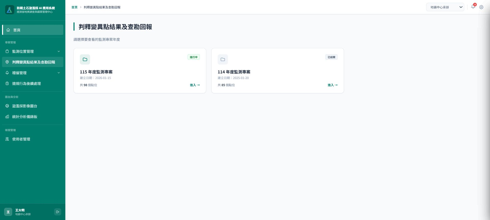

進入年度專案後的判釋變異範圍列表：

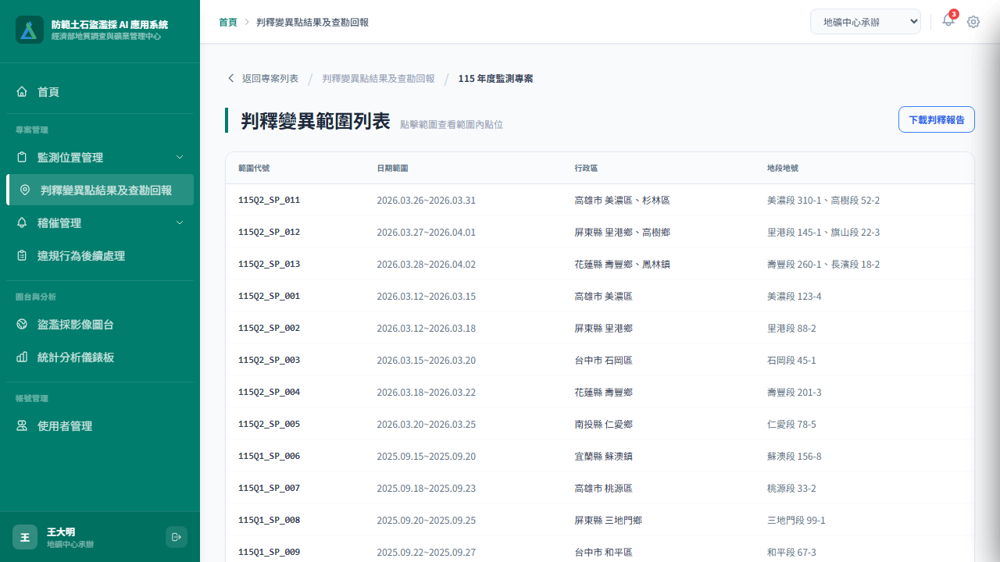

選定範圍後的變異點列表：

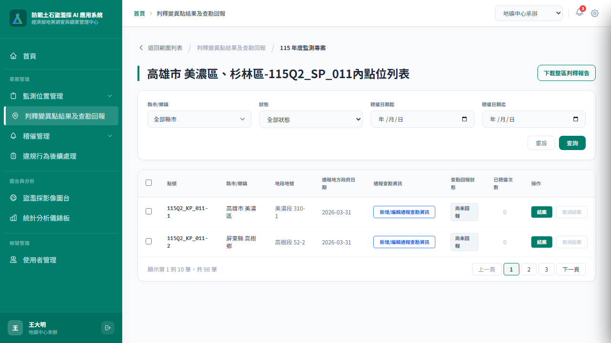

地方政府通報與查勘表單：

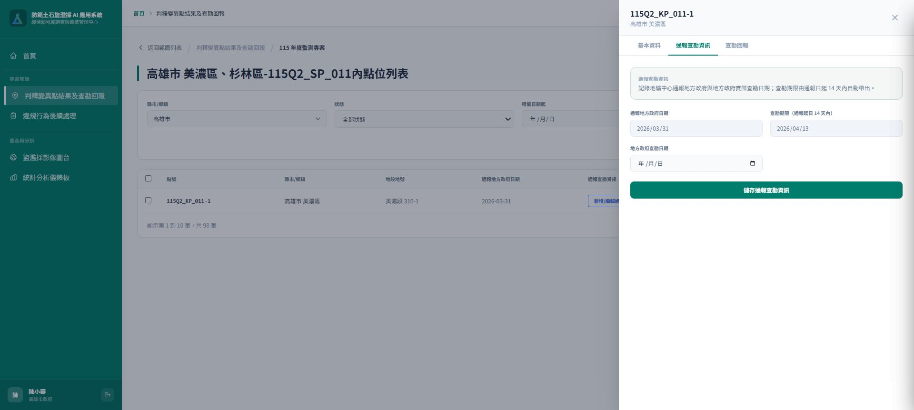

業務邏輯：空拍廠商上傳判釋報告與 KML；地礦中心承辦確認成果、填寫地方政府通報資訊；地方政府填寫查勘結果及附件；地礦中心可依結果結案。v16 點位明細已呈現 T1／T2 影像日期與實際預覽，點位列表的地礦中心末欄為「結案處理」。匯出需支援依縣市及整區輸出 PDF、Word、Excel。

| 按鈕／控制項 | 地礦中心承辦 | 空拍廠商 | 地方政府人員 | 行為 |
|---|:---:|:---:|:---:|---|
| 返回專案／範圍 | ✓ | ✓ | ✓ | 回上一層清單 |
| 重設／查詢 | ✓ 全國 | ✓ 指派專案 | ✓ 授權縣市 | 重設或執行查詢 |
| 基本資料／通報資料／查勘結果頁籤 | ✓ | ✓ 依權限唯讀 | ✓ 依權限 | 切換案件明細 |
| 上傳判釋報告 | 檢視／下載 | ✓ | — | 廠商上傳報告附件 |
| 上傳 KML | 檢視／下載 | ✓ | — | 廠商上傳變異點圖資 |
| 手動新增變異點位 | — | ✓ | — | 廠商補登指派範圍內的變異點 |
| 新增／編輯通報查勘資訊 | ✓ | — | — | 維護地方政府通報日期及內容 |
| 儲存通報 | ✓ | — | — | 儲存通報資料並形成待查勘案件 |
| 填寫回報 | — | — | ✓ 未回報案件 | 開啟查勘回報表 |
| 查看／編輯、編輯回報內容 | ✓ 查看 | — | ✓ 可編輯未結案內容 | 開啟既有回報；結案後唯讀 |
| 送出查勘結果 | — | — | ✓ | 送出查勘結果、狀態及說明 |
| 上傳附件／照片 | — | — | ✓ | 上傳現場照片或公文；須綁定案件 |
| 結案 | ✓ | — | — | 地礦中心確認結果後結案 |
| 取消結案 | ✓ | — | — | 重新開啟案件並留下原因與操作紀錄 |
| 依縣市下載 | ✓ | ✓ 指派範圍 | ✓ 授權縣市 | 選擇縣市及格式後下載 |
| 整區下載／下載整區判釋報告 | ✓ | ✓ 指派範圍 | — | 匯出整個監測區成果 |
| 全選／取消／下載 | ✓ | ✓ | ✓ | 操作下載視窗；可下載內容依角色範圍 |
| 下載報告／查看／匯出查勘結果 | ✓ | ✓ 指派成果 | ✓ 授權縣市 | 讀取或匯出允許存取的成果 |
| 發送稽催通知 | ✓ | — | — | 將逾期案件送入稽催流程 |
| 關閉 ×／上一頁／頁碼／下一頁 | ✓ | ✓ | ✓ | 關閉明細或切換清單頁次 |

### 5.7 稽催管理

**負責工程師：金億**

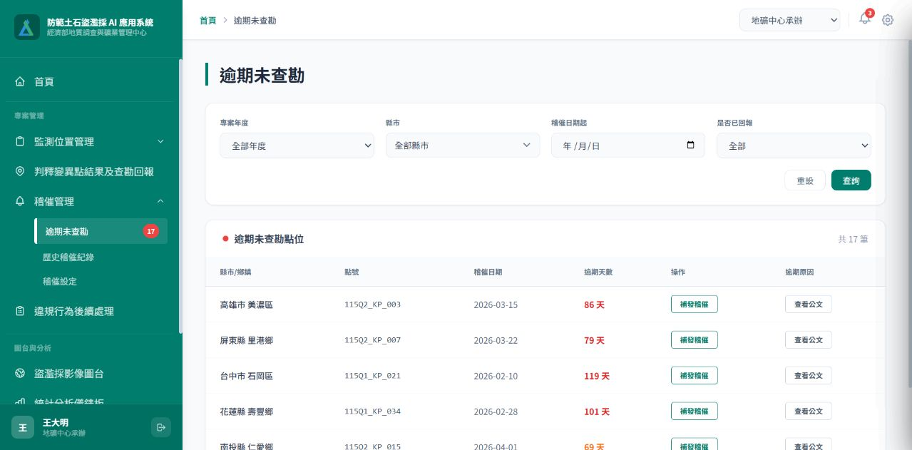

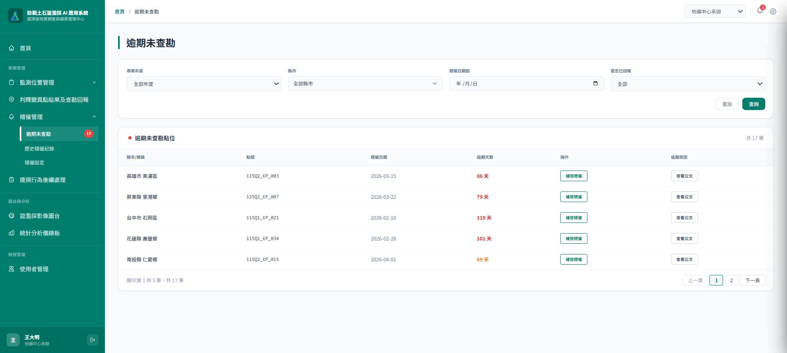

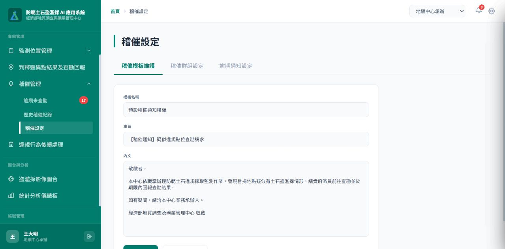

業務邏輯：只提供地礦中心承辦使用，包含逾期未查勘、歷史稽催紀錄及稽催設定。第三次以上或需人工處理的通知由承辦補發，所有寄送都需留存歷程。

| 子功能 | 按鈕／控制項 | 地礦中心承辦行為 |
|---|---|---|
| 逾期未查勘 | 重設／查詢 | 查詢全國逾期案件 |
| 逾期未查勘 | 補發稽催 | 開啟補發視窗，確認收件人與內容 |
| 逾期未查勘 | 查看公文 | 檢視地方政府上傳的逾期原因公文 |
| 補發視窗 | 新增額外 Email | 增加本次通知副本收件人 |
| 補發視窗 | 發送稽催通知 | 寄送並新增不可覆寫的稽催紀錄 |
| 補發視窗 | 取消／關閉 × | 關閉且不寄送 |
| 歷史稽催紀錄 | 重設／查詢／查看 | 查詢並開啟歷次通知內容 |
| 歷史明細 | 返回／關閉 × | 回歷史清單 |
| 稽催設定 | 通知範本／聯絡群組／通知天數頁籤 | 切換設定種類 |
| 通知範本 | 儲存範本／恢復預設 | 儲存文字或回復系統預設值 |
| 聯絡群組 | 新增聯絡人 | 增加通知對象 |
| 通知設定 | 啟用／停用切換鈕 | 控制指定通知規則是否生效 |
| 通知設定 | 儲存設定 | 儲存群組、天數及啟用狀態 |
| 清單 | 上一頁／頁碼／下一頁 | 切換清單頁次 |

### 5.8 違規行為後續處理

**負責工程師：育萱**

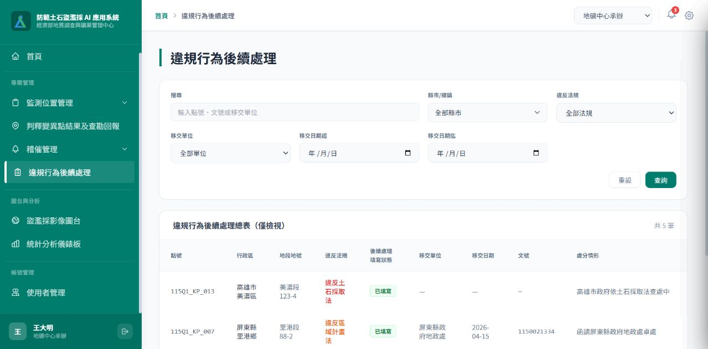

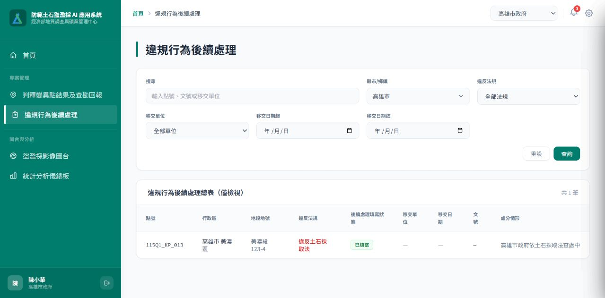

> v16 的地方政府角色目前只顯示此頁框架，內容區為空白；正式開發仍依下表完成授權縣市內的查詢與檢視。

業務邏輯：呈現已確認違規案件的後續處理結果。地礦中心承辦可查看全國，地方政府只能查看授權縣市。依目前工作項目規畫及 v16 證據，本階段以查詢與檢視為主；未明列的新增／編輯能力不自行推定。

| 按鈕／控制項 | 地礦中心承辦 | 地方政府人員 | 行為 |
|---|:---:|:---:|---|
| 重設／查詢 | ✓ 全國 | ✓ 授權縣市 | 重設或執行角色範圍內查詢 |
| 清單列／查看 | ✓ | ✓ | 開啟違規案件明細 |
| 關閉 × | ✓ | ✓ | 關閉明細抽屜／視窗 |

### 5.9 統計分析儀錶板

**負責工程師：守陽**

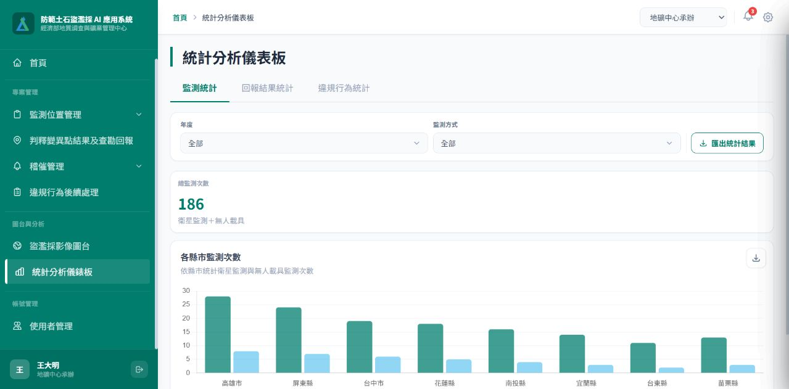

業務邏輯：彙整監測、回報及違規資料。所有統計數值、圖表及匯出檔都必須使用同一個角色資料範圍；不得只在畫面隱藏明細但回傳全國統計。

| 按鈕／控制項 | 地礦中心承辦 | 空拍廠商 | 地方政府人員 | 行為 |
|---|:---:|:---:|:---:|---|
| 監測／回報／違規頁籤 | ✓ 全國 | ✓ 指派專案 | ✓ 授權縣市 | 切換統計主題 |
| 年度／縣市／行政區／方式篩選 | ✓ | ✓ 限指派內容 | ✓ 縣市固定或限授權值 | 篩選統計資料 |
| 全部 | ✓ | ✓ 僅可選範圍 | ✓ 僅授權縣市 | 全選目前角色可存取的選項 |
| 匯出統計 | ✓ | ✓ | ✓ | 開啟匯出格式視窗 |
| 下載此圖表 SVG | ✓ | ✓ | ✓ | 下載單張圖表，不得含越權資料 |
| 取消／關閉 × | ✓ | ✓ | ✓ | 關閉匯出視窗 |
| 確認匯出 | ✓ | ✓ | ✓ | 依所選 PDF／Excel／Word 格式匯出角色範圍資料 |

### 5.10 使用者管理

**負責工程師：守陽**

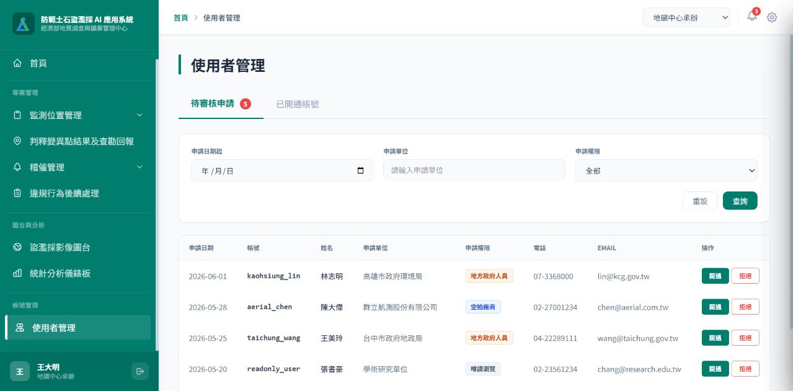

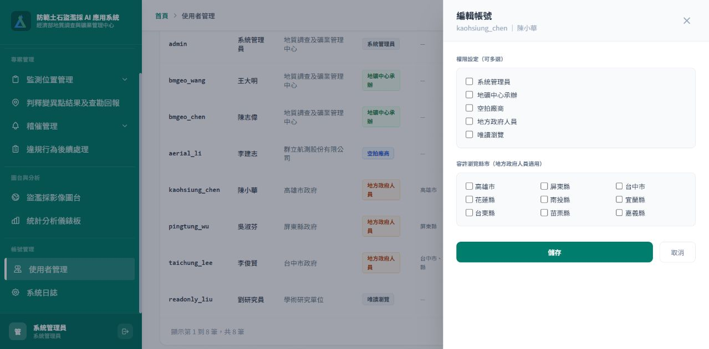

> v16 的地礦中心承辦角色目前可看到選單，但內容區為空白；正式開發仍依下表提供待審核與已開通帳號管理。

業務邏輯：地礦中心承辦與系統管理員都可管理使用者；空拍廠商及地方政府人員不可進入。角色或縣市授權變更需記錄異動前後值。

| 按鈕／控制項 | 地礦中心承辦 | 系統管理員 | 行為 |
|---|:---:|:---:|---|
| 待審核／已開通頁籤 | ✓ | ✓ | 切換帳號狀態清單 |
| 重設／查詢 | ✓ | ✓ | 清除條件或查詢帳號 |
| 開通 | ✓ | ✓ | 核准註冊並建立登入權限 |
| 拒絕 | ✓ | ✓ | 拒絕申請並記錄原因 |
| 編輯權限 | ✓ | ✓ | 編輯角色、縣市或必要的專案授權 |
| 儲存 | ✓ | ✓ | 儲存權限異動並寫入日誌 |
| 取消／關閉 × | ✓ | ✓ | 關閉編輯視窗且不儲存 |
| 停用／開通 | ✓ | ✓ | 暫停或恢復帳號登入權限 |
| 註銷 | ✓ | ✓ | 將帳號標記為註銷；歷史業務紀錄不可刪除 |
| 上一頁／頁碼／下一頁 | ✓ | ✓ | 切換清單頁次 |

### 5.11 系統日誌

**負責工程師：守陽**

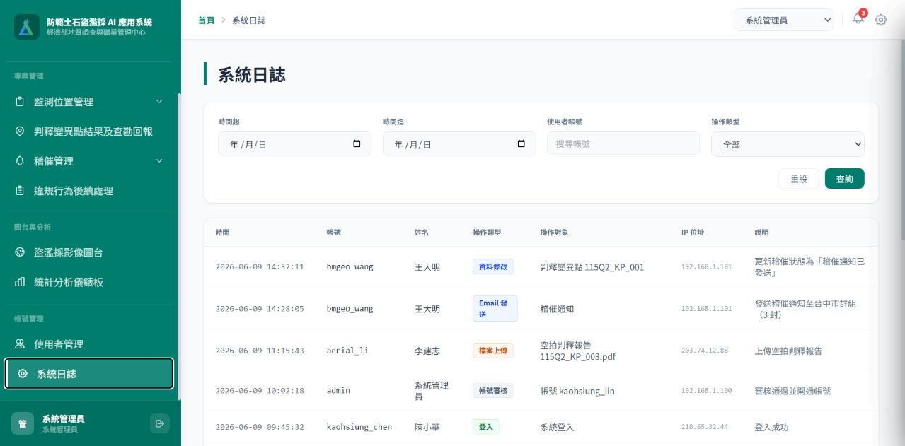

> v16 的系統管理員角色目前只顯示系統日誌頁框架，內容區為空白；正式開發仍依下表完成查詢與分頁。

業務邏輯：僅系統管理員可見，以查詢及稽核為主。地礦中心承辦即使可管理使用者，也不可查看系統日誌。

| 按鈕／控制項 | 系統管理員行為 |
|---|---|
| 重設 | 清除操作者、時間、模組及結果等條件 |
| 查詢 | 查詢系統操作紀錄 |
| 上一頁／頁碼／下一頁 | 切換日誌頁次 |

## 6. 全域選單與各角色按鈕快速核對

本節提供前端、後端及測試人員逐角色核對；同名按鈕的詳細行為以前述模組章節為準。

### 6.1 地礦中心承辦

- 全域：首頁、監測位置管理、建議監測點位、監測區位選定、判釋變異點結果及查勘回報、稽催管理、逾期未查勘、歷史稽催紀錄、稽催設定、違規行為後續處理、圖台、統計、使用者管理、通知鈴鐺、登出。
- 建議點位：返回專案列表、重設、查詢、加入建議監測、取消建議監測、下載、到圖台／在圖台圈繪監測範圍、分頁。
- 監測區位：返回、重設、查詢、確認整區拍攝、新增建議拍攝點位、新增／編輯廠商空拍資訊、儲存、取消、關閉、分頁。
- 判釋／查勘：返回、重設、查詢、基本資料／通報資料／查勘結果、新增／編輯通報查勘資訊、儲存通報、結案、取消結案、依縣市下載、整區下載、下載整區判釋報告、全選、取消、下載、下載報告、查看、匯出查勘結果、發送稽催通知、關閉、分頁。
- 稽催：重設、查詢、補發稽催、查看公文、新增額外 Email、發送稽催通知、取消、關閉、查看歷史、返回、通知範本／聯絡群組／通知天數、儲存範本、恢復預設、新增聯絡人、啟用／停用、儲存設定、分頁。
- 違規後續：重設、查詢、查看、關閉。
- 圖台：放大、縮小、回初始視域、座標定位、距離量測、面積量測、清除、圖層管理、點位查詢、空拍影像列表、儲存監測範圍、取消、顯示／隱藏選單、收合面板、清除空拍選取、返回、套疊與比對、關閉比對、查看查勘紀錄。
- 統計：監測／回報／違規頁籤、各篩選器、全部、匯出統計、下載此圖表 SVG、取消、關閉、確認匯出。
- 使用者管理：待審核／已開通、重設、查詢、開通、拒絕、編輯權限、儲存、取消、關閉、停用／開通、註銷、分頁。
- 不可見：系統日誌。

### 6.2 空拍廠商

- 全域：首頁、監測位置管理、建議監測點位、監測區位選定、判釋變異點結果及查勘回報、圖台、統計、通知鈴鐺、登出。
- 建議點位：返回、重設、查詢、加入建議監測、取消建議監測、下載、到圖台／圈繪、新增建議監測點位、建立、取消、關閉、分頁。
- 監測區位：返回、重設、查詢、手動新增監測範圍、建立、取消、關閉、分頁。
- 判釋／查勘：返回、重設、查詢、基本資料／通報資料／查勘結果、上傳判釋報告、上傳 KML、手動新增變異點位、依縣市下載、整區下載、下載整區判釋報告、全選、取消、下載、查看、關閉、分頁。
- 圖台：除地方政府不可儲存範圍外的共用圖台按鈕；資料限指派專案。
- 統計：頁籤、指派範圍篩選、全部、匯出統計、下載此圖表 SVG、取消、關閉、確認匯出。
- 不可見：稽催管理、違規行為後續處理、使用者管理、系統日誌。

### 6.3 地方政府人員

- 全域：首頁、判釋變異點結果及查勘回報、違規行為後續處理、圖台、統計、通知鈴鐺、登出。
- 判釋／查勘：返回、重設、查詢、基本資料／通報資料／查勘結果、填寫回報、查看／編輯、編輯回報內容、送出查勘結果、上傳附件／照片、依縣市下載、下載、查看、關閉、分頁。
- 違規後續：重設、查詢、查看、關閉。
- 圖台：放大、縮小、回初始視域、座標定位、距離量測、面積量測、清除、圖層管理、點位查詢、空拍影像列表、顯示／隱藏選單、收合面板、清除空拍選取、返回、套疊與比對、關閉比對、查看查勘紀錄。
- 統計：頁籤、授權縣市範圍篩選、全部、匯出統計、下載此圖表 SVG、取消、關閉、確認匯出。
- 不可見：建議監測點位、監測區位選定、稽催管理、使用者管理、系統日誌。

### 6.4 系統管理員

- 全域：使用者管理、系統日誌、登出。
- 使用者管理：待審核／已開通、重設、查詢、開通、拒絕、編輯權限、儲存、取消、關閉、停用／開通、註銷、分頁。
- 系統日誌：重設、查詢、分頁。
- 不可見：首頁與全部業務模組、通知鈴鐺、業務查詢／下載／匯出／新增／編輯／結案按鈕。

## 7. 開發分工

| 工程師 | 負責功能 | 主要交付／介接重點 |
|---|---|---|
| 忠晏 | AI 訓練 | 產出可供建議監測點位模組使用的成果；本文件不規範模型技術細節 |
| 守陽 | 登入／註冊、首頁、統計分析儀錶板、系統管理 | 統一角色登入資訊、首頁／統計資料範圍、使用者與日誌權責分離 |
| 金億 | 盜濫採影像圖台、稽催管理 | 點位／範圍圖資雙向介接、圖層範圍控管、稽催通知與歷程 |
| 育萱 | 監測位置管理、判釋變異點結果及查勘回報、違規行為後續處理 | 串接 AI 點位、空拍指派、成果上傳、通報、查勘、結案與違規後續 |

### 7.1 優先確認的跨模組契約

以下只需先確認欄位與狀態名稱，不要求在本文件展開 API 細節：

1. AI 建議點位如何識別專案、年度、座標及版本。
2. 建議點位帶入圖台、圖台監測範圍回寫時的唯一識別碼。
3. 空拍指派、成果上傳、通報、查勘及結案的狀態轉換。
4. 首頁與統計使用哪些已確認狀態計數。
5. 角色、縣市與廠商指派關係如何提供給所有模組共用。

## 8. 工程驗收重點

- 同一帳號直接輸入未授權頁面網址時，後端仍應拒絕。
- 下載、匯出、圖表及圖台圖層不得包含角色範圍外資料。
- 系統管理員登入後看不到任何業務模組，也無法呼叫業務異動功能。
- 地礦中心承辦可查全國業務資料且可管理使用者，但不可查系統日誌。
- 空拍廠商只能處理指派專案；地方政府只能處理授權縣市。
- 重要狀態異動、帳號權限異動、通知寄送、結案與取消結案均需留存操作紀錄。
- v16 雛型與正式版差異至少包含：正式版移除角色快捷登入、系統管理員退出業務模組、欲空拍點位改由地礦中心承辦新增；承辦使用者管理、地方政府違規後續處理及系統日誌的空白內容亦需補實作。
